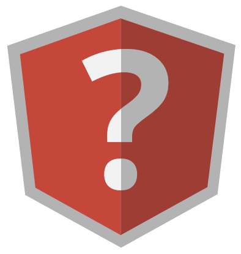
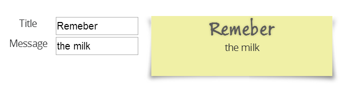

# Von Knockout zu AngularJS 

##### Table of Contents  
1. [Einleitung](#Einleitung)  
2. [Schwerpunkte](#Schwerpunkte)  
    2.1. [Bindings](#Bindings)
    2.2. [Templating](#Templating)
    2.3. [Routing](#Routing)
    2.4. [Modularer Code](#Modules)
3. [Fazit](#Fazit)     
4. [Links](#links)  


<a name="Einleitung"></a>
# 1. Einleitung

Das JavaScript-Framework [Knockout.js](http://knockoutjs.com) konzentriert sich klar auf eine Aufgabe. Diese ist das Bereitstellen einer MVVM-Engine. Zusätzliche Funktionalitäten wie modularer Code oder clientseitiges Routing müssen durch weitere Bibliotheken hinzugefügt werden. Gerade für größere SinglePage Anwendungen sind zahlreiche weitere JavaScript-Libraries nach und nach hinzuzufügen. Wer auf Knockout.js als Technologie für eine SPA (Single-Page Application) gesetzt hat, kann durch den Zechnologie-Zoo mitunter etwas ernüchtert sein. 

Im Kontrast hierzu steht [AngularJS](https://angularjs.org). Dieses Framework bietet einen viel größeren Funktionsumfang. Es sind viele Funktionalitäten vorhanden, die für eine homogene SPA-Architektur verwendet werden können. AngularJS schickt sich an "Marktführer" für SPAs zu werden und diese Position dank der Unterstützung von Google auch zu behaupten.

In dieser Session (und mit dem Ihnen hier vorliegenden Handout) werden Knockout und AngularJS miteinander vergleichen. Anhand **ausgewählter Schwerpunkte**  sollen jeweilige Vorteile und Schwächen herausgearbeitet und mit Code-Beispielen belegt werden. Johannes Hoppe beleuchtet hierbei stets die Frage ob und wie ein Umstieg von Knockout auf Angular JS sinnvoll und machbar ist bzw. wäre. 

<a name="Schwerpunkte"></a>
# 2. Schwerpunkte

Bei einer SPA-Architektur geht es im stets darum, möglichst viel Kontrollfluss- und Rendering-Logik vom Webserver auf den Browser zu bringen. Der Webserver liefert im Idealfall nur noch eine einziges HTML-Dokument aus, welches dann die Kontrolle übernimmt. Prinzipiell kann man die verschiedensten Entwurfsmuster (Pattern) auf diesem einzelnen HTML-Dokument anwenden. In der Praxis zeigt sich aber, dass das [MVC (Model-View-Controller)](http://addyosmani.com/resources/essentialjsdesignpatterns/book/#detailmvc) Pattern die bevorzugte Umsetzung ist. Diese Enwurfsmuster hat sich auf dem Server als Standard durchgesetzt. Es ist keine schlechte Idee, bewährtes auf den Browser zu übertragen. Ebenso bieten die meisten SPA-Frameworks eine [MVVM (Model-View-ViewModel)](http://addyosmani.com/resources/essentialjsdesignpatterns/book/#detailmvvm) Engine an. Diese beiden Prinzipien ergänzen sich gut. Durch ihre große inhaltliche Überschneidung bietet es sich an, beide Prinzipien in einen Topf zu werfen und kräftig umzurühren. Genauso sehen es auch die Macher von AngularJS, welche ihr Framework ganz pragmatisch ein [MVW (Model-View-Whatever (works for you))](https://plus.google.com/+AngularJS/posts/aZNVhj355G2) Framework nennen.       

Unter der Prämisse, das wir uns im Kontext einer **MVW** Anwendung bewegen, ist es legitim, folgende Schwerpunkte als Vergleichsgegenstand auszuwählen:

1. Bindings
2. Templating
3. Routing
4. Modularer Code


Es bleibt ein kleines Dilemma. Knockout.js und AngularJS sind eigentlich nicht miteinander vergleichbar. Wie Äpfel und Birnen haben beide Frameworks einen unterschiedlichen Schwerpunkt. AngularJS hat den Anspruch ein universales JavaScript-Framework für SPAs zu sein, Knockout hingegeben beschränkt sich hingegen darauf, eine MVVM Engine zur Verfügung zu stellen. Für einen fairen Vergleich lönnte man z.B. eher [Durandal](http://durandaljs.com/) und AngularJS miteinander messen.   

<a name="Bindings"></a>
## 2.1. Bindings

Das folgende Beispiel basiert auf einem einfachem Formular, welches bei Wertänderung den Inhalt eines gelben Notizzettels verändert:



In den Zeiten vor MVVM waren einfache UI-Themen zuweilen sehr komplex. Folgender Sourcode demonstriert, wie z.B. nur mit jQuery der Notizzettel verarbeitet werden muss.

```html
<script>
    $(function ($) {

        $('#Title').change(function () {
            var title = $(this).val();
            $('#jQuery_output h1').text(title);
        });

        $('#Message').change(function () {
            var message = $(this).val();
            $('#jQuery_output p').text(message);
        });

        $('#Title').change();
        $('#Message').change();
    });
</script>

<form>
    <label for="Title">Title</label>
    <input id="Title" value="Remeber">
        
    <label for="Message">Message</label>
    <input id="Message" value="the milk">
</form>

<div id="jQuery_output" class="sticky_note">
    <div>
        <h1></h1>
        <p></p>
    </div>
</div>

```

Man sieht, dass auf die einzelnen HTML-Elemente umständlich zugriffen werden muss. Eine deutliche Vereinfachung bietet hier MVVM. 
 
Die Hauptaufgabe eine MVVM Engine besteht darin den **View** (welcher in unserem Fall reines HTML ist) möglichst elegant mit dem so genannten **ViewModel** zu verbinden. Das **ViewModel** kann man als einen speziellen Controller sehen. Er stellt einerseits Daten der Geschäftslogik bzw. des Models zu Verfügung und stellt weiterhin auch Methoden für diese dar. Durch die Zwischenschicht "ViewModel", werden View und Model voneinander getrennt. Es ist nun irrelevant wo und wie das tatsächliche Model existiert. Das ViewModel "versteckt es" und stellt eine standardisierte Sicht darauf her. Häufig wird es der Fall sein, das das eigentliche Model nur auf dem Server wirklich greifbar ist. Hierzu leitet dann das ViewModel alle Operationen per **AJAX** an den Server weiter.

Diese Verbindung zwischen View und ViewModel nennt sich **Binding**, diese geht für gewöhnlich in beide Richtungen. Ändert sich das ViewModel, so wird der View aktualisiert. Ändert sich der Wert eines Interaktions-Elements (z.b. hier eines Input-Felds), so wird das ViewModel ebenso geändert. Genau dies geschieht in folgendem Beispiel, welches mit Knockout.js umgesetzt ist.

```html
<script>
    $(function () {

        var ViewModel = function () {
            this.Title = ko.observable('Remember');
            this.Message = ko.observable('the milk');
        };

        var viewmodel = new ViewModel();
        ko.applyBindings(viewmodel);

    });
</script>

<form>
    <label for="Title">Title</label>
    <input id="Title" data-bind="value: Title">    
        
    <label for="Message">Message</label>
    <input id="Message" data-bind="value: Message">
</form>
         
<div class="sticky_note">
    <div>
        <h1 data-bind="text: Title"></h1>
        <p data-bind="text: Message"></p>
    </div>
</div>
```

Bei Knockout verwendet man für die Two-Way-Bindings Objekte vom Typ `Observable`. Diese implementieren (wie der Name bereits suggeriert), das [Observer Pattern](http://addyosmani.com/resources/essentialjsdesignpatterns/book/#observerpatternjavascript). Entsprechend dazu werden die Bindungs auf HTML-Elemente mit dem data-Attribut `data-bind` spezifiziert.

In AngularJS gestalten sich einfache Szenario recht ähnlich. Erfrischend ist jedoch die Tatsache, das noch weniger JavaScript geschrieben werden muss. Dies wird durch so genannte "[Directives](https://docs.angularjs.org/guide/directive)" / Direktiven ermöglicht. Direktiven sind Marker im HTML, welche dem HTML compiler (`$compile`) von AngularJS Instruktionen geben. Es wird dadurch eine sehr deklarative Beschreibung der Applikation möglich.

```html
<body class="example" ng-app>

<form ng-init="model = { Title: 'Remember', 'Message': 'the milk' }">
    <label for="Title">Title</label>
    <input id="Title" ng-model="model.Title">
        
    <label for="Message">Message</label>
    <input id="Message" ng-model="model.Message">
</form>
   
<div class="sticky_note">
    <div>
        <h1>{{model.Title}}</h1>
        <p>{{model.Message}}</p>
    </div>
</div>

</body>
```

In diesem Beispiel finden wir die Direktiven `ng-app`, welche eine Anwendung automatisch bereitstellt ("auto-bootstrap"), `ng-init`, welche Code ausführt (eval) und hier z.B. quick-and-dirty ein Model setzt und `ng-model`, welche den View und das Model per Two-Way-Binding verbindet. 

Es fällt auf, dass das Model keine Observables implementieren muss. Das obrige Beispiel ist ein wenig dirty, "model" ist in wirklichkeit nicht das Model, sondern ein neu erstelltes Property am `$scope`, welcher das eigentlich ViewModel ist. In der Dokumentation von AngularJS wird übrigens nicht zwischen "Model" und "ViewModel" unterschieden. ("typisch" **MVW**)      

**Ist ein Wechsel möglich?**

Ein Austausch der MVVM Engines ist möglich, da AngularJS prinzipiell den Funktionsumfang von Knockout.js abdeckt und zusätzlich erweitert. Beide Engines verwenden den **DOM** als View, so dass nicht alles neu geschrieben werden muss. Die Direktiven können dabei helfen, die Anzahl an Code-Zeilen zu minimieren. Stolpersteine wird es definitiv durch den Umstand geben, dass ein AngularJS Model nicht "observable" ist. Dieses Prinzip nennt sich "**dirty checking**". Hinter den Szenen setzt AngularJS für jedes Binding eine so genannte `$watch` in eine Liste. ([Info zu $watch und $digest](http://angular-tips.com/blog/2013/08/watch-how-the-apply-runs-a-digest/)) Die Watches werden verwendet um Änderungen zu erkennen. Hinzu kommen Standardfunktionalitäten wie `$timeout` oder `$http`, welche das dirty checking berücksichtigen. In den meisten Fällen werden Änderungen korrekt erkannt, aber intensive Tests sind notwendig um wirklich sicher zu sein.


<a name="Templating"></a>
## 2.2. Templating

[TODO]

<a name="Routing"></a>
## 2.3. Routing

[TODO]

<a name="Modules"></a>
## 2.4. Modularer Code

[TODO]


<a name="links"></a>
## 9. Links

Knockout.js: http://knockoutjs.com  
AngularJS: https://angularjs.org
MVC: http://addyosmani.com/resources/essentialjsdesignpatterns/book/#detailmvc  
MVVM: http://addyosmani.com/resources/essentialjsdesignpatterns/book/#detailmvvm  
MVW: https://plus.google.com/+AngularJS/posts/aZNVhj355G2  
Observer Pattern: http://addyosmani.com/resources/essentialjsdesignpatterns/book/#observerpatternjavascript  
$watch: http://angular-tips.com/blog/2013/08/watch-how-the-apply-runs-a-digest/

<hr>

_&copy; 2014, Johannes Hoppe_